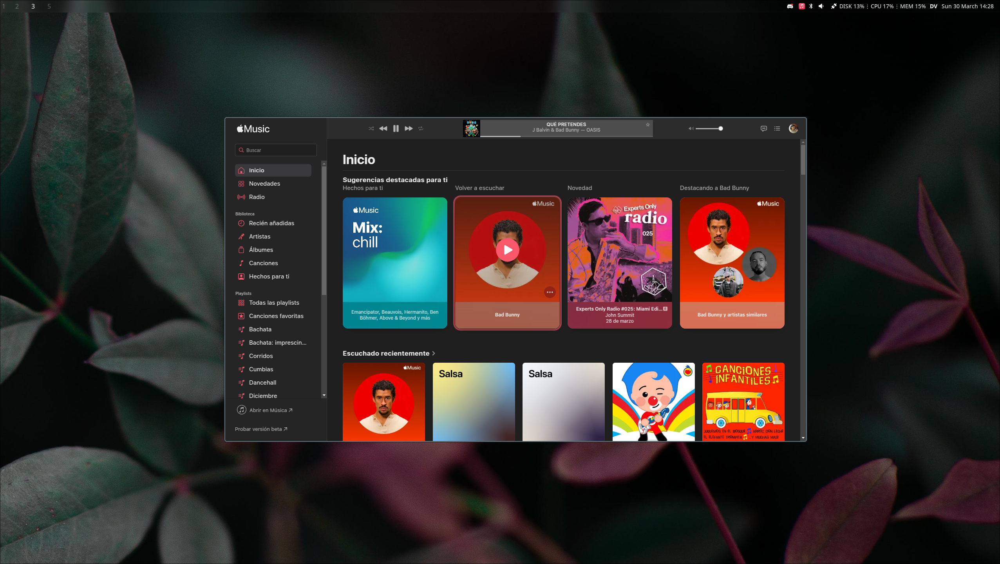
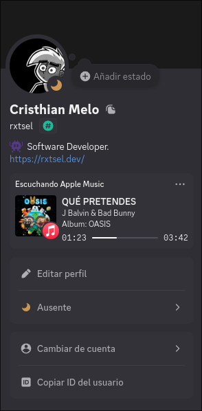
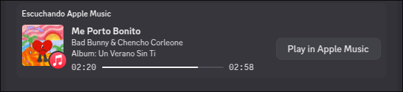

# 🎵 AMusic

A simple discord rich presence client for apple music build in Tauri and Rust.



|  |  |
| ------------- | -------------- |
|  |  |

>[!WARNING]
> This application only works on Linux and has been tested on Arch Linux with Wayland.

## Features

- Use Apple Music in app mode with Chromium
- Native performance with Rust backend
- MPRIS integration for Linux
- Minimal resource usage
- Tray icon support
- MPRIS Privacy ensures only Apple Music data from the matching PID is shared,
  protecting other media players (YouTube, Spotify, etc.) from Discord integration

## Development

AMusic is built using:

- [Rust](https://www.rust-lang.org/) for the core functionality
- [Tauri](https://tauri.app/) for cross-platform desktop capabilities

### Prerequisites

- Rust and Cargo
- Chromium

### Steps

1. Clone the repository:

    ```sh
    git clone git@github.com:rxtsel/amusic.git

    # Go to the project directory
    cd amusic
    ```

2. Run the application in development mode:

    ```sh
    cargo tauri dev
    ```

### Create AppImage

```sh
NO_STRIP=true cargo tauri build
```
